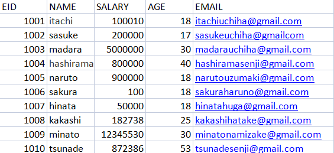
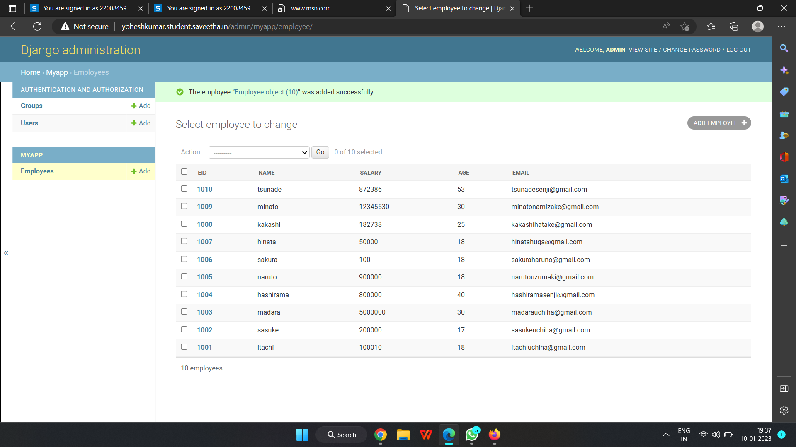

# Django ORM Web Application

## AIM
To develop a Django application to store and retrieve data from a database using Object Relational Mapping(ORM).

## Entity Relationship Diagram:

Include your ER diagram here

## DESIGN STEPS

### STEP 1:

### STEP 2:

### STEP 3:

Write your own steps

## PROGRAM

Include your code here

## OUTPUT

## RESULT:
program is successfully executed
